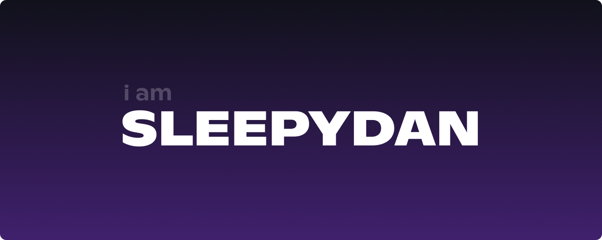

### Hey I'm Dan!

Welcome to my profile, im into building web apps and checking out new tech. Always keen to learn and get involved in fun projects, lets make something awesome.

                                                                                                                      
## Technologies & Tools

| **Web Development**                                                                                                                                                                           | **Back-End & Databases**                                                                                                                                                              | **DevOps & Tools**                                                                                                                                                                | **Programming**                                                                                                                                                          | **IDEs & Design Tools**                                                                                                                                                                |
|-----------------------------------------------------------------------------------------------------------------------------------------------------------------------------------------------|---------------------------------------------------------------------------------------------------------------------------------------------------------------------------------------|------------------------------------------------------------------------------------------------------------------------------------------------------------------------------------|--------------------------------------------------------------------------------------------------------------------------------------------------------------------------------------------------------|------------------------------------------------------------------------------------------------------------------------------------------------------------------------------------------|
| <code></code> JavaScript                                          | <code></code> Node.js                                      | <code></code> Docker                                   | <code></code> Python                                                          | <code></code> VS Code                                           |
| <code></code> TypeScript                                          | <code></code> Express                                    | <code></code> Nginx                                     | <code></code> Bash                                                            | <code></code> Visual Studio                          |
| <code></code> React                                                  | <code></code> MySQL                                          | <code></code> Linux                                    | <code></code> npm                                                              | <code></code> Figma                                           |
| <code></code> Next.js                                              | <code></code> PostgreSQL                            | <code></code> Cloudflare                      | <code></code> Bun                                                              |                       |
| <code></code> Tailwind CSS                                  | <code></code> MongoDB                                    | <code></code> Vercel                                 | <code></code> Discord.js                                                |                                                                                                                                                                                         |

---
